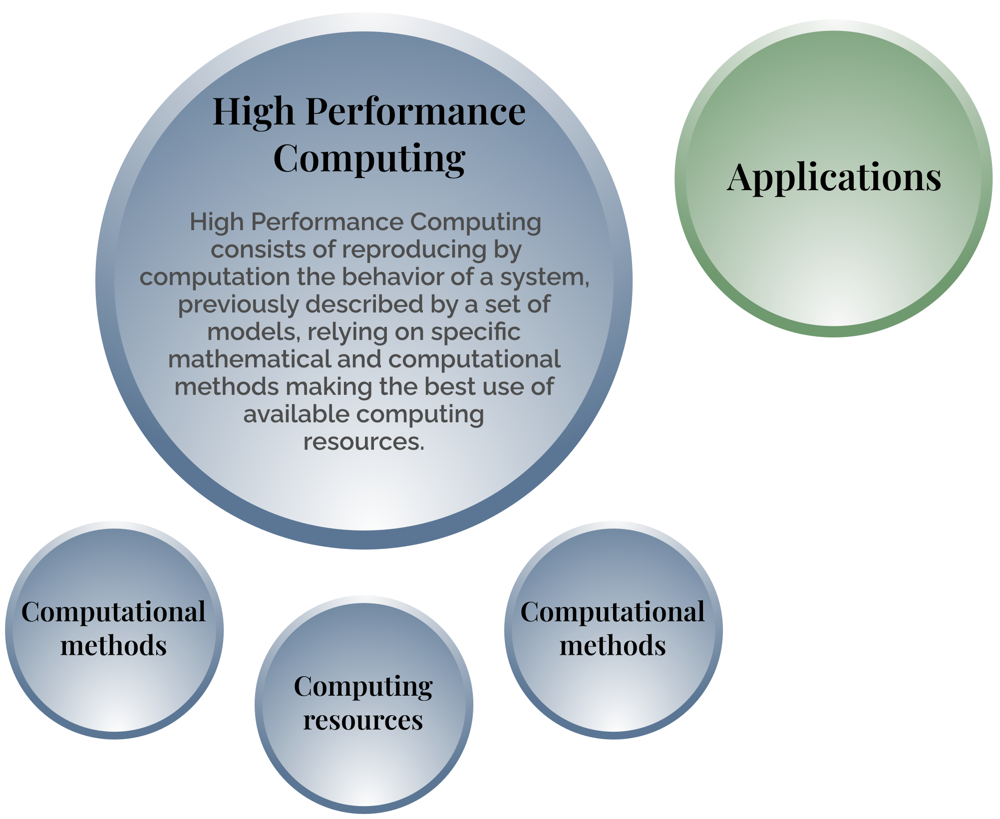
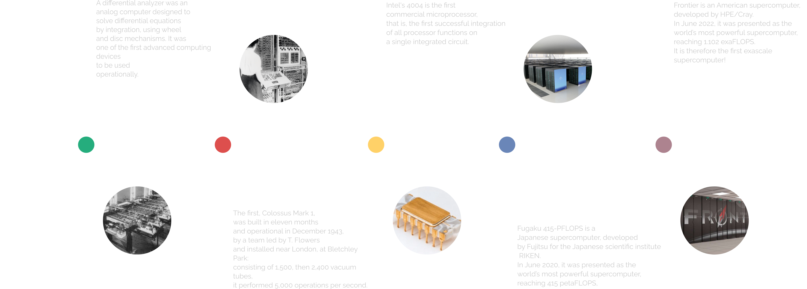
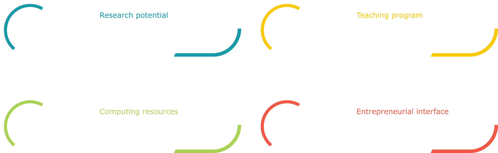
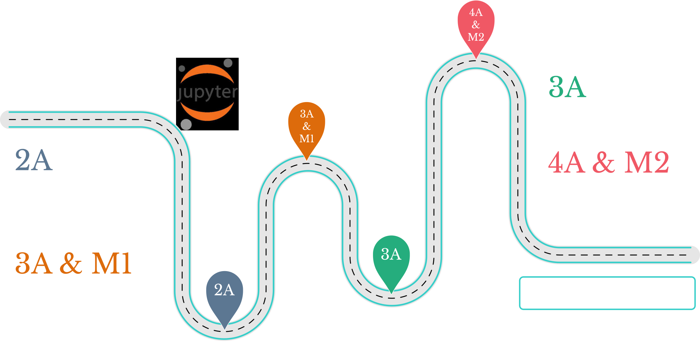

<!-- ::: {.hidden}
\DeclareMathOperator{\N}{\mathcal{N}}
\newcommand{\test}{f_{\text{test}}}
\renewcommand{\phi}{\varphi}
::: -->

```{=html}
<link href="https://cdn.jsdelivr.net/npm/bootstrap@5.3.0/dist/css/bootstrap.min.css" rel="stylesheet">
<script src="https://cdn.jsdelivr.net/npm/bootstrap@5.3.0/dist/js/bootstrap.bundle.min.js"></script>
```

::::{.center-page-vertically-2}
:::{.row}
::::{.col-8 .text-center }
{width="60%"}
::::
::::{.col-4 .align-self-center .border .fragment .border-2}

:::{.color-0}
**Outline**
:::

- Evolution of architectures, mathematics, and algorithms
- Scientific and technological innovation: illustrations
- The HPC@Maths Initiative and its impact at l'X

::::

:::
::::
---

:::{.center-page}

:::

---

:::{.center-page .r-stack}
{.fragment .fade-out data-fragment-index=0}

{.fragment .current-visible data-fragment-index=0}

{.fragment .current-visible}

{.fragment}
:::

---

::::{.center-page-vertically-2}
:::{.row}
::::{.col-7 .align-self-center .text-center}
{width="80%"}
::::
::::{.col .align-self-center}

**Complexity at every level**

- SIMD
- NUMA-aware
- Accelerator cards (GPU, FPGA, …)
- Interconnected compute nodes

:::{.text-center .color-0}
**Non-unified memory**
:::

<br>
**A wide variety of tools**

- OpenMP
- Cuda
- MPI
- OpenAcc
- ...

::::
:::
::::

---

:::{.center-page}

:::

## {.center data-background-image="figures/couloir.jpg" data-background-position="left" data-background-size="50%"}

::::{.row}

:::{.col-6}
:::

:::{.col-6 .p-5}
It is now essential to understand all components and their interactions to take full advantage of the resources made available.

The required expertise has become complex and the choices numerous.
:::
::::

## Evolution of mathematical methods

:::{.row}
::::{.col}
**Parallel progression to Moore's Law**

- An example: solving sparse linear systems
- Illustration from a SIAM society reflection in 2001 on the emerging field of "Computational Science and Engineering"
- Valid until around 2005, then gradual saturation on "classical" topics in the discipline

:::{.fragment fragment-index=0}
**Emergence of new approaches**

- Since 2010, paradigm shifts and innovative solutions in numerical analysis → breakthroughs
- HPC: simulating large-scale problems on classical architectures (biomedical engineering)
- Example: time and space adaptation (operator splitting to integrate time dynamics) and error control
:::

<br>

:::{.fragment .text-center .color-0 fragment-index=0}
**Transition to a new chapter of numerical analysis since 2010**
:::

::::
::::{.col-5 .r-stack .text-center}
:::{.fragment fragment-index=0 .fade-out}
{width=80%}
:::
:::{.fragment fragment-index=0 .current-visible}
{width=80% .video-responsive-30}

<video class="video-responsive-30" data-autoplay loop src="videos/ignition_Re1000.mov" />
:::
::::
:::

## Innovation

:::::{.center-page-vertically-2}
:::{.row}
::::{.col-7 .align-self-center}
Lies at the intersection of:

::: {.nonincremental}
- Contribution to new mathematical approaches, emergence
:::
::: {.nonincremental}
- New computing architectures and implementation techniques
:::
::: {.fragment fragment-index=1}
- **Challenges of scientific and technological innovation = network of collaborations with other disciplines and companies**
:::
::::
::::{.col}
:::{.r-stack}


{.fragment fragment-index=1}
:::
::::
:::
:::::

---

:::::{.center-page-vertically-2}
:::{.row}
::::{.col-3 .align-self-center .text-center}
{.video-responsive-25}

{.video-responsive-25}
::::
::::{.col .align-self-center .p-4 .border}

:::{.text-center .color-0 .h1 .display-6}
Multi-scale two-phase flows
:::

</br>

:::{.text-center  .color}
**Predictive simulation of physical phenomena**

**on new computing architectures**
:::

</br>

- Innovative mathematical modeling
- Next-generation numerical methods
- Development of efficient open-source computational codes

</br>

:::{.text-center .color-0 .h1 .display-6}
Design - safety - efficiency
:::

::::
::::{.col-3 .align-self-center .text-center}
{.video-responsive-25}

{.video-responsive-25}
::::
:::
:::::

---

:::{.center-page}
{width=60%}
:::

## Droplet spray: solved!

:::::{.center-page-vertically-2}
:::{.row .align-items-center}
::::{.col-8 }
**Polydisperse droplet sprays**

- Predictive simulation of spray dynamics and evaporation → Flame structure and dynamics

:::{.color}
**Combustion**
:::

- Liquid propulsion, solid propulsion, Ariane Booster: combustion / acoustics / polydisperse spray coupling (thermo-acoustic instabilities)

**Strongly coupled gas-droplet turbulence**

- New large-scale approach - divergence-free wavelets

</br>

:::{.text-center .color-0 .h2}
New generation of fluid models and accurate and efficient numerical methods - HPC
:::

::::
::::{.col .align-self-center .text-center}
{.video-responsive-25}

<video class="video-responsive-30" data-autoplay loop src="videos/y1_y3_3d.m4v">
</video>

::::::{.row}
:::::::{.col .text-center}
{.video-responsive-10}
:::::::
:::::::{.col .text-center}
{.video-responsive-10}
:::::::
:::::::{.col .text-center}
{.video-responsive-10}
:::::::
::::::
::::
:::
:::::

## Atomization - unified model - breakthrough!

:::::{.center-page-vertically-2}
:::{.row}
::::{.col .border .align-self-center}

:::{.text-center}
**Classical models**
:::

</br>

***Separated phases*** regime

- Bi-fluid Eulerian mixture models with volume fraction $\alpha$
- Limited information on interface geometry ($\alpha$, $\nabla \alpha$) - mesh

</br>

***Dispersed phases*** regime

- Eulerian moment models
- High information on interface geometry with droplet size distribution ($\alpha$, $\Sigma$, $H$, $G$)

</br>

:::{.color-0}
**PhD A. Loison, W. Haegeman**

**Post-doc G. Orlando**
:::
::::
::::{.col .text-center .align-self-center}
{.video-responsive-30}

<video class="video-responsive-30" data-autoplay loop src="videos/droplets-collision-3x.mp4">
</video>
::::
::::{.col .border .align-self-center}

:::{.text-center .color-0}
**Two-scale unified model**
:::

</br>

:::{.border .p-1}
::::{.color-0}
***Large scale***
::::

- Eulerian bi-fluid mixture models for all topologies with volume fraction $\alpha$
:::

</br>

:::{.text-center .fs-3 .border .rounded-pill }
Inter-scale transfer

::::{.fs-5 .small-lh}
Primary atomization, coalescence

Interface geometry via ($\alpha$, $\nabla \alpha$)
::::
:::

</br>

:::{.border .p-1 .m-2}
::::{.color-0}
***Small scale***
::::

Oscillating droplet model based on ($\alpha^d$, $\Sigma$, $H$, $G$ + dynamic variables)

- Differential geometry / kinetic models
:::
::::
:::
:::::
<!--  -->

## Atomization - unified model - simulation

:::{.text-center}
<video class="video-responsive-40" data-autoplay loop src="videos/large_scale_small_scale_adaptive_contours.mp4" />
:::

:::{.text-center}
<video class="video-responsive-40" data-autoplay loop src="videos/large_scale_small_scale_adaptive_finale.mp4"/>
:::

## Lattice Boltzmann Method

:::{.row}
::::{.col-8}
**Context**

- High-performance simulation of landing gear noise (NASA Ames Advanced Supercomputing Division - Launch Ascent and Vehicle Aerodynamics LAVA) 2.28 billion degrees of freedom - 12 levels
- Simulation on Pleiades machine (2800 cores - two weeks) Acceleration by a factor of 15 compared to classical techniques

**Breakthrough: PhD Thomas Bellotti**

- Numerical analysis of methods (consistency / stability)
- Implementation in samurai: resolution of several decades of questions regarding the use of adaptive meshes

</br>

:::{.text-center .color-0}
**Breakthrough and innovation: more accurate and more efficient simulation**
:::

</br>

Paul Caseau Thesis Prize 2024 Académie des Technologies / PhD Thesis Prize from the Société de Mathématiques Appliquées et Industrielles GAMNI 2024

::::
::::{.col .text-center .align-self-center}
<video class="video-responsive-30" data-autoplay loop src="videos/LBM_Landing_Gear_NASA_compressed.mp4">
</video>

</br>

:::{.row}
::::{.col-8}
<video class="video-responsive-30" data-autoplay loop src="videos/config_12_2_9_1e-3.mp4">
</video>

::::

::::{.col .align-self-center}


</br>


::::
:::
::::
:::

## Samurai

:::{.row}
::::{.col-8}
**Tool for a range of applications**

- Plasma physics (electric propulsion, space weather prediction, electron transpiration cooling…)
- Two-phase flows (liquid propulsion, aeronautical propulsion, direct injection engines, missile launch plume)
- Direct numerical simulation of lithium batteries

<br>

**Innovation**

- New data structure based on set algebra
- Ease of implementing new schemes (independent of dynamic mesh management) enabling the creation of an ecosystem for applications

<br>
<br>

:::{.text-center .color-0}
**Open Source community code**

[https://github.com/hpc-maths/samurai](https://github.com/hpc-maths/samurai)

**Same code for both presented applications**
:::

::::
::::{.col .text-center}

:::{.row }
::::{.col .align-self-center}

::::
::::{.col .align-self-center}
{width=80%}
::::
:::

:::{.row }
::::{.col .align-self-center}

::::
::::{.col .align-self-center}
{width=60%}
::::
:::

:::{.row }
::::{.col .align-self-center}
{width=30%}
::::
::::{.col .align-self-center}

::::
:::
:::{.row }
::::{.col .align-self-center}
{width=15%}
::::
:::

<br>

{width=80%}
::::
:::
## HPC@Maths

:::{.center-page}
{width=80%}

<br>

::::{.color-0}
**Established since 2017 with the support of the Fondation de l'X**

**Significant impact on the teaching-research ecosystem at l'X**
::::
:::

## Computing and Data Mesocenter {data-background-image="figures/serveurs.png" data-background-position="right" data-background-size="40%"}

**École polytechnique - IP Paris**

::::{.center-page-vertically-2}
:::{.row}
::::{.col-6 .align-self-center}
- Operational since summer 2021
- 2000 compute cores for the community of founding laboratories
- Scaling up to 3000 cores and new partners
- Community around next-generation numerical methods and their implementation
- "Computational Science" - Interdisciplinary collaboration
::::
:::
::::

## {data-background-image="figures/foret.png" data-background-position="left" data-background-size="40%"}

:::{.row}
::::{.col}
::::
::::{.col-7}
<h2>Creation of the IDCS Service Unit</h2>

- Created in May 2020 at École polytechnique
- Inspired by what is done in major universities (Stanford, EPFL)
- Team of ASR and COMPUTING engineers supporting major IT infrastructure projects of the School and IP Paris
- Responsiveness to infrastructure and Data Center evolution - Support for the community
- Vocation to become a Research Support Unit (CNRS)

<br>

:::{.text-center .mt-5 .color-0}
**Significant effort carried out successfully on these achievements**

**with strong support from École polytechnique / IPP**

<br>

**The HPC@Maths Initiative has played a key role**
:::
::::
:::

## Teaching

:::{.center-page}
{width=90%}

<br>

::::{.color-0}
**Training program established - interaction with SMEs & Pedagogy Development**
::::
:::


## Conclusion

:::{.row}
::::{.col-7 .align-self-center}
**Relevant positioning at the heart of innovation**

- Mathematical expertise (CMAP)
- Computing expertise (Group of expert research engineers in computing - developers)
- Network of collaborations across various scientific axes and companies
- Production of open-source software

**Creation of an ecosystem - School and IP Paris**

**Project in strong progress**
::::
::::{.col}
{width=80%}
::::
:::
:::{.text-center .color-0 .align-self-end .mt-5}
**Made possible thanks to the support of the Fondation**
:::

## Acknowledgments

**Students, engineers, and collaborators**

- PhD students and post-doctoral researchers
- Computing, Valorization, and Project Manager engineers
- Collaborators within CMAP and elsewhere
- Industrial collaborators, SMEs, startups

**École polytechnique - IP Paris**

- CMAP
- IDCS Unit
- Teaching and learning center hub

**Fondation de l'X**

- Campaign direction
- The entire Fondation team
- Major donor for their listening, support, and advice

##

:::::{.center-page}
{.video-responsive-20}

<br>
<br>

<h4>Thank you for your attention</h4>

<br>
[HPC@Maths](https://initiative-hpc-maths.gitlab.labos.polytechnique.fr/site/)
:::::

<!--  -->